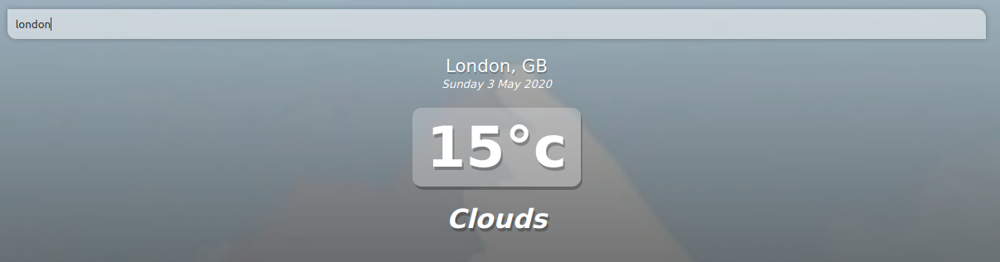

# Weather Vue

> Weather app using Vue.js

## Prerequisites
```
a) Kubernetes Cluster -> Deployment of Vue application
b) Dockerhub -> save our docker image
c) Jenkins Machine -> Continuous Integration and Deployment on Kubernetes cluster.
```

## Getting Started

### Step: 1

```
# clone repo 
# https://github.com/anandpatnaik2010/vue-application.git
```
### Step: 2

```
a) Once the repository is cloned, we can build docker image by executing following command by using "Dockerfile".
   Example: docker build -t anandpatnaik/vue:test-v1.0 .
b) It will build an image as per the instructions mentioned in Dockerfile, once the image is built we can verify by "docker images".
c) Now push the docker image to the private or public repository i.e. Dockerhub or Harbor or ECR.
```

### Step: 3
```
**Kubernetes Cluster**

a) Create a Kubernetes cluster using AWS KOPS or EKS Control Plane with 2/3 core nodes depending on the requirement.
b) Deploy Vue application using "kubernetes-vue-manifest" folder which consist of deployment & service yaml files. 
   Deployment file consist of image tag, container port & resources for CPU & RAM.
   Service file consist of exposing the application by nodeport for development & testing purpose. (it can also exposed by load balancer using ingress)
```

### Step:4 
```
**Jenkins - Conitnious Integration & Deployment**

a) Install Jenkins plugins such as AWS Credential, Github.
b) Create new credentials for authenticating dockerhub, github & kubernetes cluster access & secret key (applicable for AWS EKS cluster)
c) Create a new pipeline job with Definition as "Pipeline script from SCM" and configure SCM as "Git" and provide repository URL & credentials.
d) Once the above configuration is updated then save & apply. 

Note: Our Jenkinsfile is present in Github so it will build the code as steps mentioned in the Jenkinsfile.
  Short Description on Jenkinsfile:
  I) First, it will check-out the code into the workspace of Jenkins machine.
  II) In second stage it will build the docker image using Dockerfile and push to Dockerhub.
  III) Finally, once the image is pushed to dockerhub  then it will deploy the newly build image to the kubernete cluster using the "AWS Credentials" and "kube config" file. 
```


# Sample Image:




### Reference Link
```
> API Key used to fetch weather report.
https://openweathermap.org/api

Vue : 

https://vue-loader-v14.vuejs.org/en
http://vuejs-templates.github.io/webpack
```

## Build Setup

``` bash
# install dependencies
npm install

# serve with hot reload at localhost:8080
npm run dev

# build for production with minification
npm run build

# build for production and view the bundle analyzer report
npm run build --report
```
